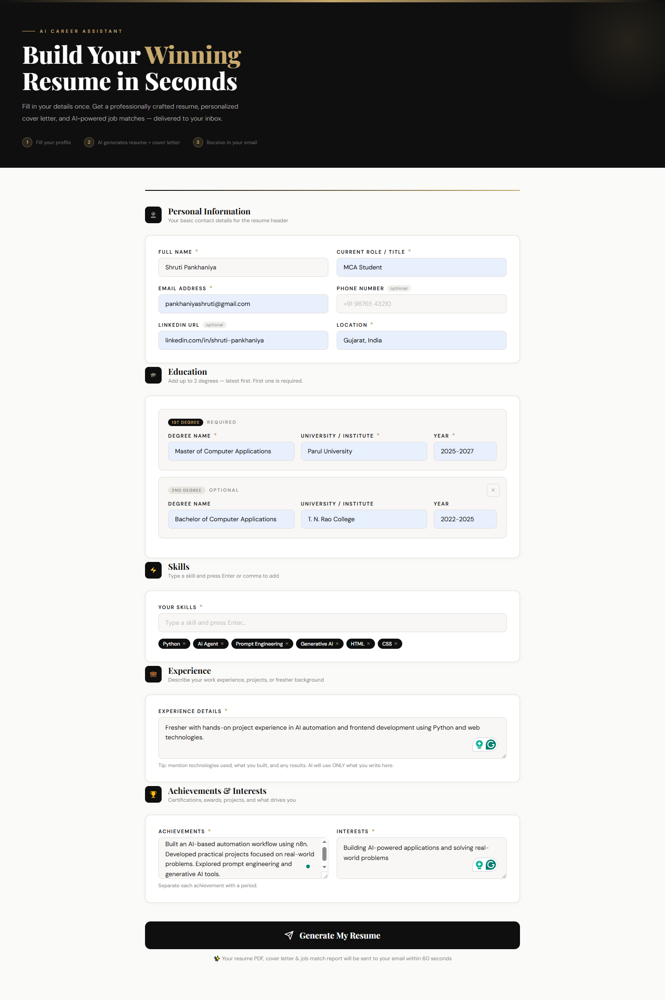
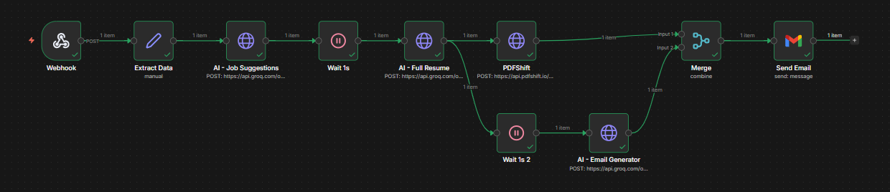
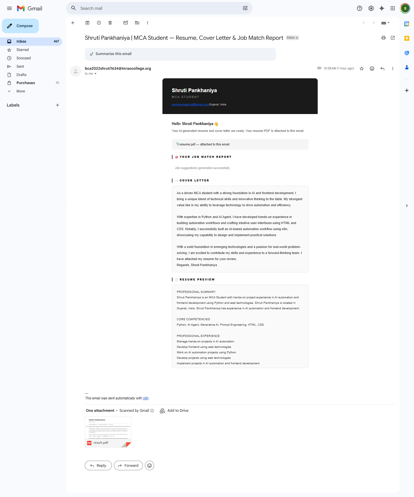
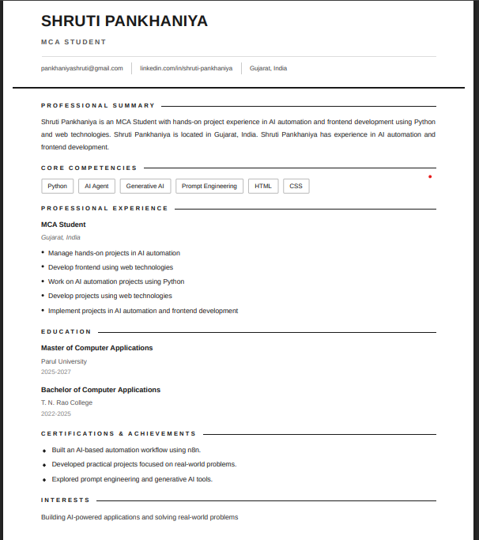

# 🚀 AI Career Assistant

An intelligent AI-powered system that generates a professional resume, personalized cover letter, and job match recommendations in a single automated workflow.

---

## ✨ Features

- 📄 AI-generated professional resume  
- ✉️ Personalized cover letter  
- 🎯 Job match suggestions with relevance scores  
- 📧 Automatic email delivery with PDF resume  
- 🧠 Controlled AI output (no fake or hallucinated data)  

---

## ⚙️ Tech Stack

- n8n – Workflow automation  
- Groq API – LLM-based content generation  
- PDFShift – Resume PDF generation  
- HTML, CSS, JavaScript – Frontend UI  

---

## 🎥 Demo Video

🔗 https://drive.google.com/file/d/1zWZRo4n0ObgdVjxpYT8JD_08MBplDtPD/view  

---

## 📸 Screenshots

  
  
  
  

---

## 💡 How It Works

1. User fills in their profile details  
2. AI analyzes input and matches suitable roles  
3. Resume and cover letter are generated  
4. Resume is converted into a PDF  
5. Email is sent with all outputs  

---

## 🧠 Key Highlight

> This system ensures **truthful and structured AI output** by strictly using user-provided data, avoiding hallucinations commonly seen in generative AI systems.

---

## 🎯 Goal

To build a **real-world AI agent** that combines:

- Automation  
- Decision-making  
- Content generation  

into a single seamless experience.

---

## 🔥 Project Type

**AI Agent / AI-Powered Product**
